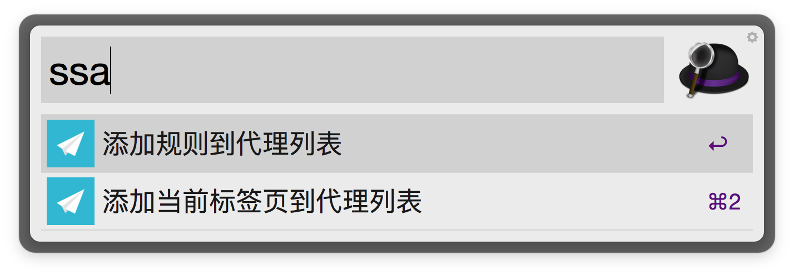

# AlfredWorkflows

## ShadowsocksAddCustomRule

为 Shadowsocks 添加自定义代理规则

触发指令：ssa

### 不添加参数时

将当前焦点标签页域名加入代理列表（目前仅支持 Chrome ）

### 添加参数时

将参数位规则加入代理列表中

> 默认 user-rules.txt 位于/User/当前用户名/.ShadowsocksX

## Turn to ITerm

触发快捷键shift＋option＋command＋I

V 1.0.0

打开ITerm2
